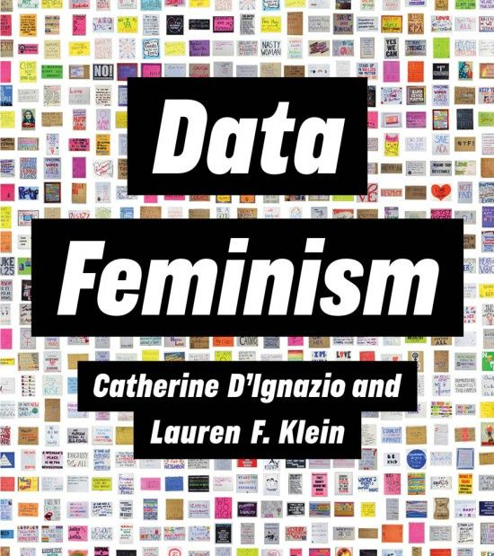
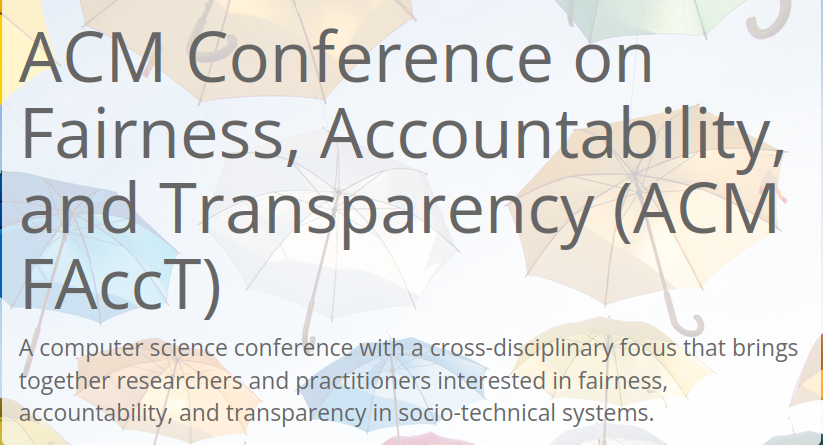
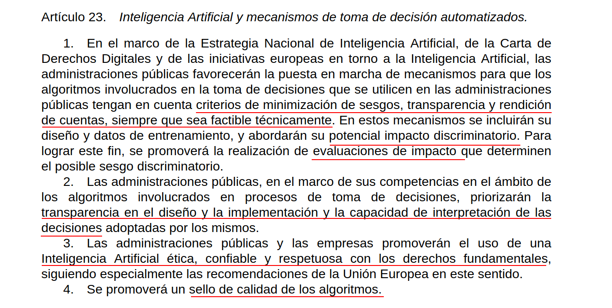
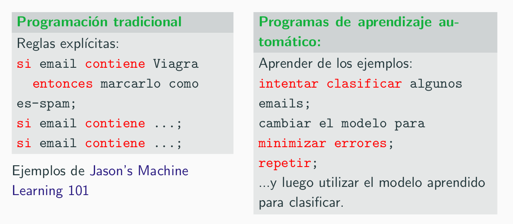
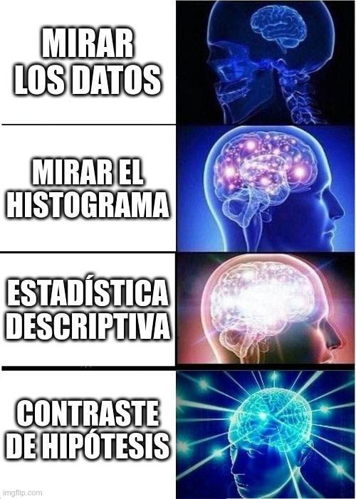
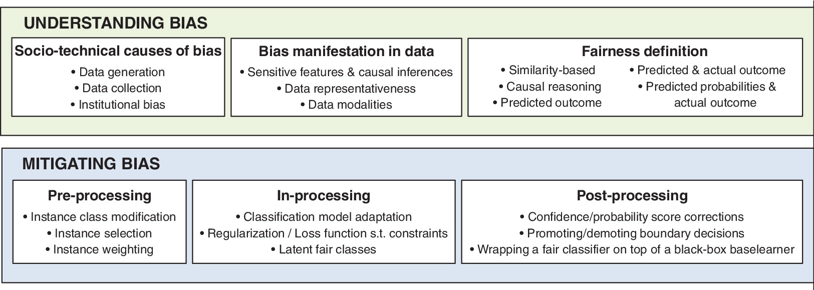
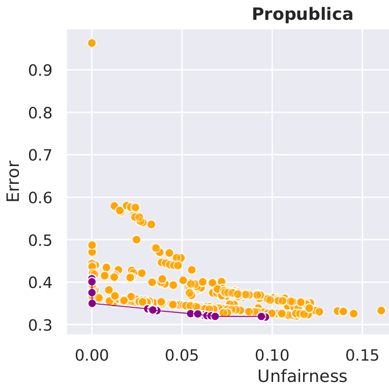

# Equidad, Rendición de Cuentas, Transparencia y Ética en el Aprendizaje Automático
### Departament de Matemàtiques i el Màster Universitari Investigació Aplicada en Estudis Feministes, de Gènere i Ciutadania. 9/02/2024

Javier Sánchez Monedero. Universidad de Córdoba. 
(jsanchez arroba uco.es)

--- 

# Objetivos

- Introducción y motivación a FATE en inteligencia artificial
- Cuantificando y mitigando sesgos: [FairLearn](https://fairlearn.org/)

---
<!-- _backgroundColor: "#123" -->
<!-- _color: "#fff" -->
##### <!--fit--> Introducción y motivación a FATE
--- 

# ¿Por dónde empezar? Libros

  

<!--
--- 

# ¿Por dónde empezar? Libros

   
-->
--- 

# ¿Por dónde empezar? En vídeo

- Documental [Coded Bias](https://www.codedbias.com/)
- TED Talk de Joy Buolamwini [How I'm fighting bias in algorithms](https://www.ted.com/talks/joy_buolamwini_how_i_m_fighting_bias_in_algorithms)

---
# FATE:

- **Fairness**: imparcialidad/ecuanimidad
- **Accountability**: rendición de cuentas
- **Transparency**: transparencia 
- **Ethics**: ética

[facctconference.org](https://facctconference.org/)
[facctconference.org/network](https://facctconference.org/network/)

---
# Objetivos del seminario

Discriminación en **sistemas/modelos** que toman decisiones trascendentales
- Esto no considera otras formas de discriminación o injusticia
- Las cuestiones de discriminación/igualdad necesitan de otro tipo de intervenciones no técnicas (ver libros recomendados)

**La discriminación no es un concepto general**, depende: 
- Dominio del problema
- Grupo social

<!-- La presentación de [Judging the algorithm](https://arxiv.org/abs/2203.03723) dará una visión más **interdisciplinar** de este problema.  -->

---
# Grupos protegidos

Clases protegidas (no en todos los contextos): 
- EEUU: “raza”, color, sexo, religión, ciudadanía, embarazo, edad...
- España: género, embarazo, “raza” (ley igualdad de trato), embarazo...

La definición de grupos protegidos va más allá e incluye las categorías [no binarias](https://www.genderbread.org/) y la [interseccionalidad](https://es.wikipedia.org/wiki/Interseccionalidad)

> [There’s No Scientific Basis for Race—It’s a Made-Up Label](https://www.nationalgeographic.com/magazine/2018/04/race-genetics-science-africa). National Geographic. 2018, March 12. 

<!--
Con el "pero" de lo difícil de expresar la pertenencia a grupo, es interesante [intersectionalityscore.com](https://intersectionalityscore.com/)

-->

---
# Ley integral igualdad de trato y no discriminación

[Artículo 23 Ley 15/2022, de 12 de julio](https://www.boe.es/buscar/doc.php?id=BOE-A-2022-11589): 

---
# Las personas también tienen sesgos

 

Diferencias (O'Neil 2016): 
* Sistematización
* Escala
* Nuevos grupos "digitales" discriminados

> O’Neil, C (2018). [Armas de destrucción matemática](https://capitanswing.com/libros/armas-de-destruccion-matematica/)

---
# Breve introducción al aprendizaje máquina

Como nadie está programando explícitamente a menudo se asume(asumía) que es justo, no discrimina, está libre de sesgos humanos, es efectivo, etc.

---
# Tareas y funciones de pérdida

Aprender de los datos es **aprender a "conectar"** la entrada con la salida

| Entrada | Salida | 
----------|---------
| datos tabulares | riesgo fallo hepático [1,40) |
| imagen dermatoscópica | dianóstico melanoma [0,1]
| comentario de código | código programación (texto más probable)|
| artículo científico | resumen (texto más probable) | 

---
# Casos: PNL + Visión Artificial

> Zhao, J. et. al (2017). [Men Also Like Shopping: Reducing Gender Bias Amplification using Corpus-level Constraints.](https://www.aclweb.org/anthology/D17-1319) 

---
# Casos: reconocimiento facial

Análisis interseccional del rendimiento en reconocimiento facial de Amazon Rekognition. La menor tasa de acierto se da para las mujeres de piel oscura. 

> Fuente Buolamwini (2019). [Response: Racial and Gender bias in Amazon Rekognition — Commercial AI System for Analyzing Faces.](https://medium.com/@Joy.Buolamwini/response-racial-and-gender-bias-in-amazon-rekognition-commercial-ai-system-for-analyzing-faces-a289222eeced)

---
# Casos: justicia

* **COMPAS** (*Correctional Offender Management Profiling for Alternative Sanctions*): herramienta para calcular puntuaciones de riesgo de reincidencia de una persona en espera de juicio
* Utiliza ML para entrenar un modelo de estimación de **riesgo a partir de los registros históricos**
* **Variables de entrada**: historial criminal, tipo de cargos, género, grupo étnico, edad, preguntas sobre el entorno...
* **Variable dependiente**: grado de riesgo los grados altos van a prisión preventiva

---
# Casos: justicia

> Angwin, J., & Larson, J. (2016, May 23). [Machine Bias](https://www.propublica.org/article/machine-bias-risk-assessments-in-criminal-sentencing). ProPublica. 

---
<!-- _backgroundColor: "darkgreen" -->
<!-- _color: "cornsilk" -->
# A1. ¿Cómo cuantificarías el sesgo en los problemas anteriores?

<!-- Penitenciario: "Predicción" riesgo de reincidencia: el sistema sobreestima el riesgo para afroamericanos en comparación con población blanca-->
* **Reconocimiento facial**: el modelo tiene menos precisión identificando mujeres con piel oscura
* **Justicia**: el modelo sobreestima el riesgo de reincidencia de afroamericanos
* **Procesamiento lenguaje natural**: el sistema reproduce estereotipos de género asociados a profesiones

---
<!-- _backgroundColor: "#123" -->
<!-- _color: "#fff" -->
##### <!--fit--> Cuantificando y mitigando sesgos

---
# ¿Cómo medir y mitigar el sesgo?

~~Ecuanimidad sin hacer nada (*unawareness*)~~

Actualizada del [NIPS 2017 Tutorial on Fairness in Machine Learning](https://fairmlbook.org/tutorial1.html)

---
# Análisis exploratorio

- Comprobar distribución (prevalencia/prior) etiqueta de clase
- Comprobar distribución (prevalencia/prior) etiqueta de clase por grupos
- Comprobar: 
  - Visual
  - Estadística descriptiva
  - Contraste de hipótesis

Un ejemplo excelente lo podeis ver en Straw, I., & Wu, H. (2022).

> Straw, I., & Wu, H. (2022). Investigating for bias in healthcare algorithms: A sex-stratified analysis of supervised machine learning models in liver disease prediction. BMJ Health & Care Informatics, 29(1), e100457. https://doi.org/10.1136/bmjhci-2021-100457

<!--
# Definición formal
-->

--- 
# El "zoo" de las métricas de ecuanimidad

> Castelnovo, A., Crupi, R., Greco, G. et al. A clarification of the nuances in the fairness metrics landscape. Sci Rep 12, 4209 (2022). https://doi.org/10.1038/s41598-022-07939-1

---
<!-- _backgroundColor: "darkgreen" -->
<!-- _color: "cornsilk" -->
# A3. Caso judicial

* Supongamos test genérico (con o sin técnicas estadísticas) de estimación de riesgo de reincidencia. ¿Qué errores debemos minimizar?
* Respecto a la clase: ¿qué metricas nos interesan?
* ¿Y si el test implica pérdida de libertad?

---
# Casos: COMPAS

* **ProPublica**: el sistema discrimina porque sobrestima el riesgo para las personas afroamericanas (falsos positivos diferentes para los grupos: 44,8 % vs 23,4 %)
* **Northpointe**: el sistema no discrimina porque clasifica el riesgo alto por igual (verdaderos positivos similares para todos los grupos étnicos: 63 % vs 59 %)

> Larson, J., & Angwin, J. (2016, May 23). [How We Analyzed the COMPAS Recidivism Algorithm](https://www.propublica.org/article/how-we-analyzed-the-compas-recidivism-algorithm). ProPublica. 

---
# Casos: COMPAS

¿Cómo pueden ser compatibles las definiciones matemáticas de
equanimidad de ProPublica y Northpointe?

> Source [Han Solo and Bayesian Priors](https://www.countbayesie.com/blog/2015/2/18/hans-solo-and-bayesian-priors)

---
# Casos: COMPAS

Es matemáticamente compatible porque la prevalencia/frecuencia base/probabilidad a priori de los dos grupos es diferente (ver Chouldechova (2017)).

> A. Chouldechova. Fair Prediction with Disparate Impact: A Study of Bias in Recidivism Prediction Instruments. Big Data, 5(2):153–163, 2017. https://doi.org/10.1089/big.2016.0047 
---
<!-- _backgroundColor: "darkgreen" -->
<!-- _color: "cornsilk" -->
# A4. ¿Cómo podemos mitigar?

* Ya tenemos una medida del sesgo estadístico
* ¿Cómo podríamos mitigar?
* Pero antes: **¿tiene sentido una intervención estadística/algorítmica?**

---
# Técnicas de mitigación de sesgos

> Fuente Ntoutsi, E., Fafalios, P., Gadiraju, U., Iosifidis, V., Nejdl, W., Vidal, M.-E., … Staab, S. (2020). Bias in data-driven artificial intelligence systems—An introductory survey. WIREs Data Mining and Knowledge Discovery, 10(3), e1356. https://doi.org/10.1002/widm.1356

  
<!-- ---
# Inventarios de casos

[Automating Society Report 2020](https://automatingsociety.algorithmwatch.org/report2020/spain)

[Observatory of Algorithms with Social Impact](https://eticasfoundation.org/oasi) -->

---
# Herramientas ML para mitigación y explicabilidad

https://fairlearn.org/

Otras: 

https://ai-fairness-360.org/

https://pair-code.github.io/what-if-tool/

---
# Cuaderno Jupyter con FairLearn y COMPAS

- Datos de reincidencia general de COMPAS
- Experimentos simplificados de ProPublica

https://github.com/javism/seminarioUJI
  
<!-- https://github.com/javism/seminariofate2022/blob/master/IndianLiverPatientDataset-seminar.ipynb -->

<!--
---
# Heurísticas para cuantificar el sesgo: 

> Fuente https://textbook.coleridgeinitiative.org/chap-bias.html#dealing-with-bias 

-->

---
<!-- _backgroundColor: "#123" -->
<!-- _color: "#fff" -->
##### <!--fit--> Resumen y Conclusiones 

---
# Recap: Fuentes de sesgo

> Fuente Luke Vilain.

---
# Resumen

* El paso de prototipos de investigación a aplicaciones reales de la inteligencia artificial ha motivado la aparición de muchas áreas
* No solo FATE: IA robusta, privacidad en IA (aprendizaje federado, cifrado homeomórfico...), interacción persona-máquina (HCI)...
* Áreas implicadas según contexto: ética, derecho, política **¡¡Sistemas sociotécnicos!!**
* Regulaciones (IA Act, GDPR, Ley Rider, AESIA...) y estándares (IEEE,ISO)
* Oportunidades de aprendizaje y comprender mejor los problemas y los conceptos de estadística.

<!-- 
---
# Oportunidades de aprendizaje e investigación

* Revisitar problemas desde otros puntos de vista
* Mejorar entendimiento de la inteligencia artificial y la estadística
* Trabajar con equipos interdisciplinares y diversos
* Trabajar con colectivos
  
-->
---
# Trabajos relacionados de AYRNA

## Explorar límites de precisión vs ecuanimidad

Valdivia, A., Sánchez‐Monedero, J., & Casillas, J. (2021). How fair can we go in machine learning? Assessing the boundaries of accuracy and fairness. *Int J Intel Sys*, 36(4), 1619–1643. https://doi.org/10.1002/int.22354

## Gender-Equity model for Liver Allocation

El grupo AYRNA, IMIBIC y otros centros trabajan en alternativas al MELD que no discriminen por género como estimador de riesgo de mortalidad en trasplantes hepáticos. https://gema-transplant.com/

---
# Trabajos relacionados de AYRNA

## Desarrollo Ley Rider

Guía práctica y herramienta sobre la obligación empresarial de información sobre el uso de algoritmos en el ámbito laboral. *Ministerio de Trabajo y Economía Social. Gobierno de España*. 2022. https://prensa.mites.gob.es/WebPrensa/noticias/laboral/detalle/4125

## Proyecto AlgoRace

Proyecto AlgoRace. Investigación sobre discriminación racial e inteligencia artificial. 2021-2024. https://algorace.org/

---
# Referencias (I)

- O’Neil, C (2018). Armas de destrucción matemática. Capitán Swing. https://capitanswing.com/libros/armas-de-destruccion-matematica/

- Catherine D'Ignazio and Lauren F. Klein (2020). Data Feminism. MIT Press. https://mitpress.mit.edu/9780262044004/

- Solon Barocas and Moritz Hardt and Arvind Narayanan (2019). *Fairness and Machine Learning: Limitations and Opportunities*. http://www.fairmlbook.org

- Moritz Hardt (2020). *Fairness and Machine Learning* ([Part 1](https://www.youtube.com/watch?v=Igq_S_7IfOU), [Part 2](https://www.youtube.com/watch?v=9oNVFQ9llPc)) (MLSS 2020)

- Zhao, J. et. al (2017). Men Also Like Shopping: Reducing Gender Bias Amplification using Corpus-level Constraints. https://www.aclweb.org/anthology/D17-1319

- Buolamwini (2019). [Response: Racial and Gender bias in Amazon Rekognition — Commercial AI System for Analyzing Faces.](https://medium.com/@Joy.Buolamwini/response-racial-and-gender-bias-in-amazon-rekognition-commercial-ai-system-for-analyzing-faces-a289222eeced)
  
---
# Referencias (II)

- Verna, E. C., & Lai, J. C. (2020). Time for Action to Address the Persistent Sex-Based Disparity in Liver Transplant Access. JAMA Surgery, 155(7), 545–547.https://doi.org10.1001/jamasurg.2020.1126

- Straw, I., & Wu, H. (2022). Investigating for bias in healthcare algorithms: A sex-stratified analysis of supervised machine learning models in liver disease prediction. BMJ Health & Care Informatics, 29(1), e100457. https://doi.org/10.1136/bmjhci-2021-100457

- Castelnovo, A., Crupi, R., Greco, G. et al. A clarification of the nuances in the fairness metrics landscape. Sci Rep 12, 4209 (2022). https://doi.org/10.1038/s41598-022-07939-1

- Ntoutsi, E., Fafalios, P., Gadiraju, U., Iosifidis, V., Nejdl, W., Vidal, M.-E., … Staab, S. (2020). Bias in data-driven artificial intelligence systems—An introductory survey. WIREs Data Mining and Knowledge Discovery, 10(3), e1356. https://doi.org/10.1002/widm.1356

- A. Valdivia, C. Hyde-Vaamonde, J. García-Marcos. Judging the algorithm: A case study on the risk assessment tool for gender-based violence implemented in the Basque country. https://arxiv.org/abs/2203.03723